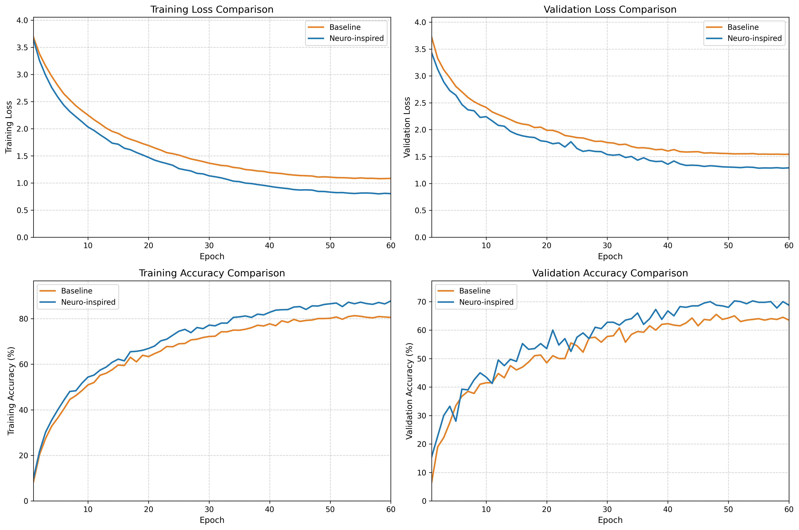
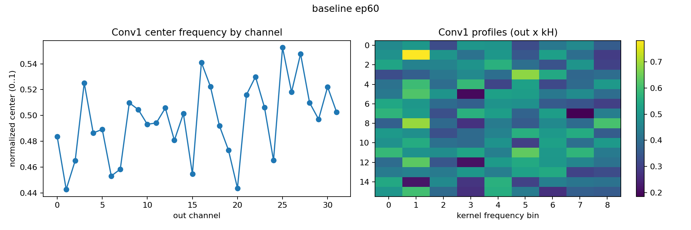
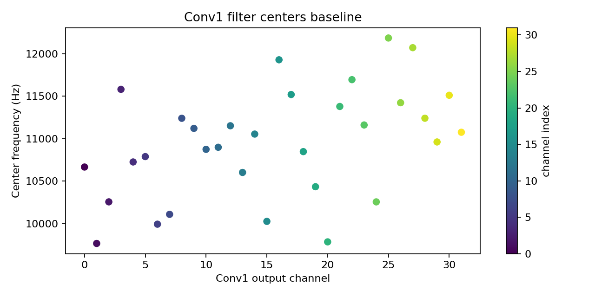
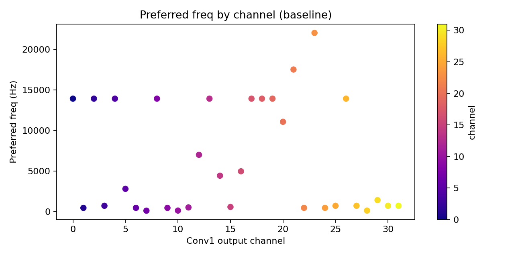
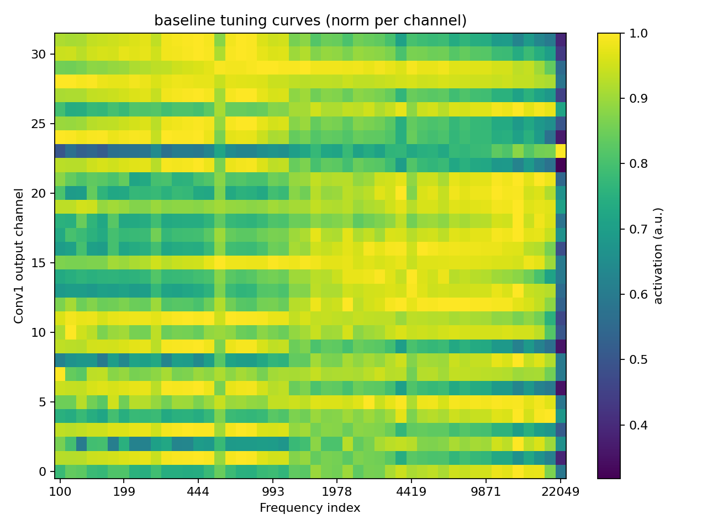
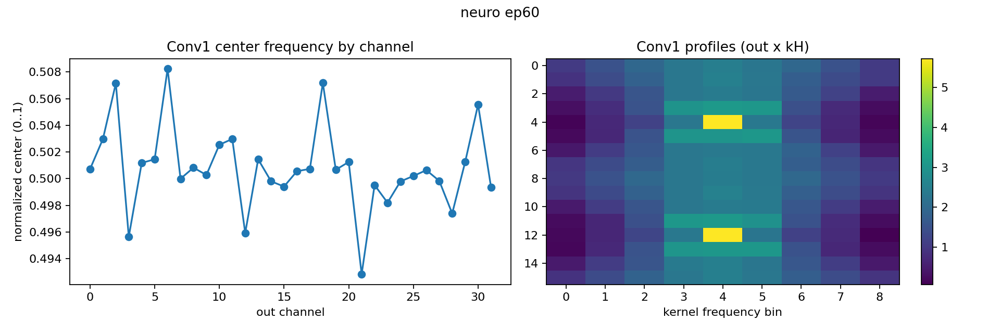
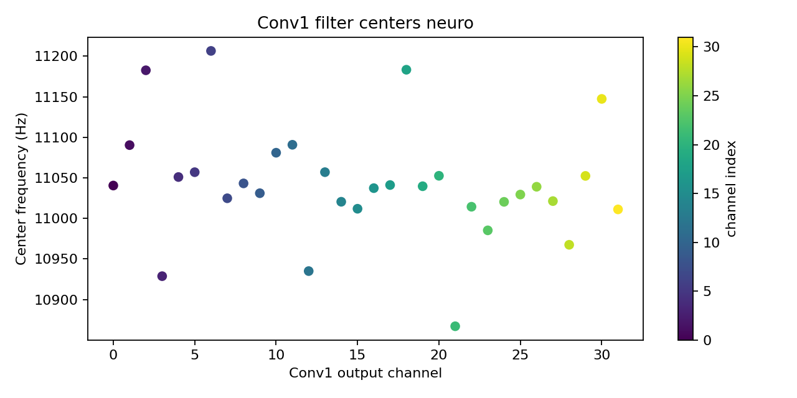
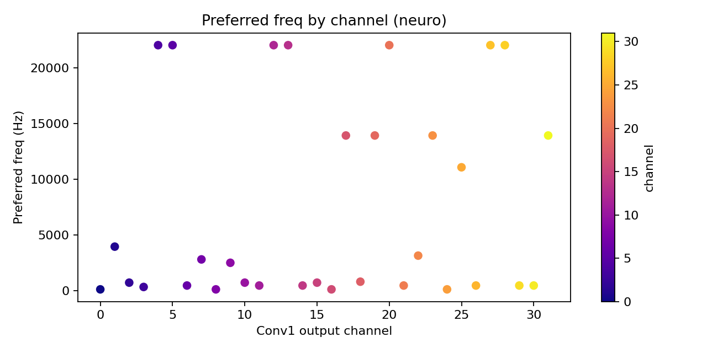
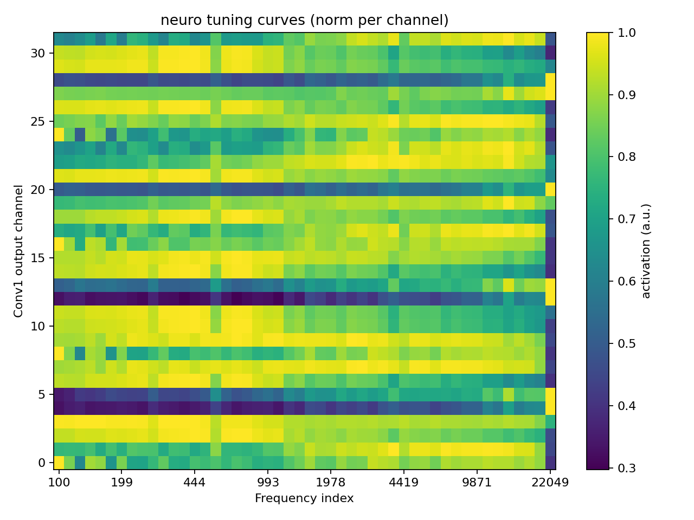

# TonotopyCNN — Neuroscience-Inspired Audio Classification

This project explores **neuroscience-inspired convolutional networks** for sound classification using the **ESC-50 dataset**.
It compares a standard baseline CNN with a **tonotopic / Gabor-initialized CNN** that mimics the **frequency-selective organization of the auditory cortex**.

## Motivation

In the human auditory system, neurons are spatially organized by the frequencies they respond to — a phenomenon known as **tonotopy**.
This project aims to encode a similar structure into early convolutional layers, using **Gabor-like filters** and **frequency-based regularization**, to investigate whether such biologically inspired priors improve performance and interpretability.

## Results

### Performance Comparison

### Baseline CNN Visualizations

**Conv1 Filters at Epoch 60**

**Tonotopic Organization Analysis**

### Neuro-Inspired CNN Visualizations

**Gabor-Initialized Conv1 Filters at Epoch 60**

**Tonotopic Organization Analysis**

